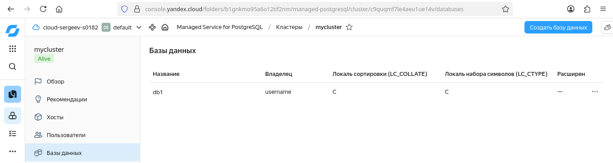
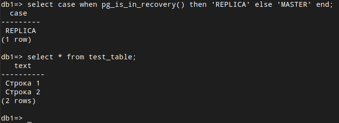

# Домашнее задание к занятию "Базы данных в облаке" - Сергеев Александр

### Инструкция по выполнению домашнего задания

   1. Сделайте `fork` данного репозитория к себе в Github и переименуйте его по названию или номеру занятия, например, https://github.com/имя-вашего-репозитория/git-hw или  https://github.com/имя-вашего-репозитория/7-1-ansible-hw).
   2. Выполните клонирование данного репозитория к себе на ПК с помощью команды `git clone`.
   3. Выполните домашнее задание и заполните у себя локально этот файл README.md:
      - впишите вверху название занятия и вашу фамилию и имя
      - в каждом задании добавьте решение в требуемом виде (текст/код/скриншоты/ссылка)
      - для корректного добавления скриншотов воспользуйтесь [инструкцией "Как вставить скриншот в шаблон с решением](https://github.com/netology-code/sys-pattern-homework/blob/main/screen-instruction.md)
      - при оформлении используйте возможности языка разметки md (коротко об этом можно посмотреть в [инструкции  по MarkDown](https://github.com/netology-code/sys-pattern-homework/blob/main/md-instruction.md))
   4. После завершения работы над домашним заданием сделайте коммит (`git commit -m "comment"`) и отправьте его на Github (`git push origin`);
   5. В личном кабинете прикрепите и отправьте ссылку на решение в виде md-файла в вашем Github.
   6. Любые вопросы по выполнению заданий спрашивайте в разделе “Вопросы по заданию” в личном кабинете.
   
Желаем успехов в выполнении домашнего задания!
   
### Дополнительные материалы, которые могут быть полезны для выполнения задания

1. [Руководство по оформлению Markdown файлов](https://gist.github.com/Jekins/2bf2d0638163f1294637#Code)

---

### Задание 1

Создал кластер.

1. Перешел на главную страницу сервиса Managed Service for PostgreSQL. 
2. Создал кластер PostgreSQL со следующими параметрами: 
- класс хоста: c4a-c2-m4, диск network-ssd 10Gb; 
- хосты: два хоста в двух разных зонах доступности, указал необходимость публичного доступа (публичного IP адреса); 
- учётная запись для пользователя: username и базы: db1.
Остальные параметры оставил практически по умолчанию.
Нажал кнопку «Создать кластер» и дождался окончания процесса создания, статус кластера = ALIVE.

Подключился к мастеру и реплике.

Использовал docker и docker compose: cкачал SSL-сертификат и подключился к кластеру с помощью утилиты psql,
указав hostname всех узлов и атрибут target_session_attrs=read-write.

Проверил, что подключение прошло к master-узлу:
select case when pg_is_in_recovery() then 'REPLICA' else 'MASTER' end;

Посмотрел количество подключенных реплик:
select count(*) from pg_stat_replication;

Проверил работоспособность репликации в кластере.

Создал таблицу и вставьте одну-две строки:
CREATE TABLE test_table(text varchar);
insert into test_table values('Строка 1');

Вышел из psql командой \q.

Подключился к узлу-реплике, для чего в команде подключения исключил атрибут target_session_attrs и в параметре
атрибут host передал имя хоста-реплики. Роли хостов можно посмотрел на соответствующей вкладке UI консоли.

Проверил, что подключение прошло к узлу-реплике:
select case when pg_is_in_recovery() then 'REPLICA' else 'MASTER' end;

Проверbk состояние репликации:
select status from pg_stat_wal_receiver;

Для проверки, что механизм репликации данных работает между зонами доступности облака, выполнил запрос к таблице,
созданной на предыдущем шаге: 
select * from test_table;

Приложил скриншоты созданной базы данных и результат вывода команды на реплике select * from test_table;

